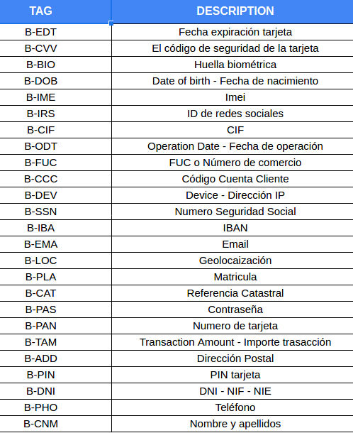
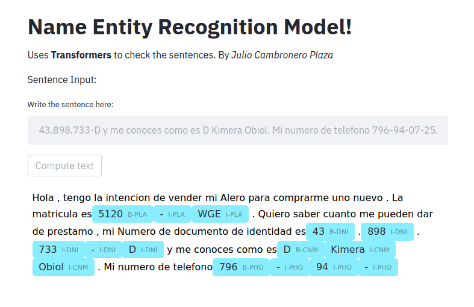

# Name Entity Recognition (NER) Model

This aim of this model is to detect sensitive data:

**Those are all tags available:**

An example would be:

for more info [NER Documentation](https://github.com/Leo223/NER-JulioCP-model)

